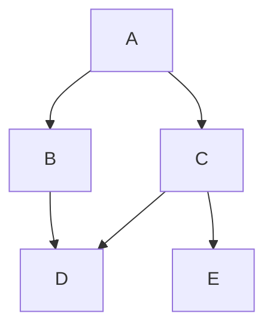

## The Cyber Boardroom - Community edition

Welcome to Community Edition of the The Cyber Boardroom, here you will be able to get more details about this project and some of its more advanced features

### GitHub Repo

This version is hosted on the public repo [the-cyber-boardroom/cbr-community](https://github.com/the-cyber-boardroom/cbr-community/)

### Report issues

Please use the Issues in this repo to submit ideas, comments or bugs: [cbr-community/issues](https://github.com/the-cyber-boardroom/cbr-community/issues)
### UI Experiments:

- [Three LLMs](/web/chat/three-llms)
- [Three + One LLMs](/web/chat/three-plus-one-llms)
- [Three Exec's personas](/web/chat/three-execs-personas)
- [three-board-members](/web/chat/three-board-members)
- [speak in 3 languages](/web/chat/three-system-prompts)
- [speak in 6 languages](/web/chat/six-languages)

### test graph

------
[edit this page](https://github.com/the-cyber-boardroom/cbr-community/edit/dev/cbr_community/custom/cbr_static/content/en/web-pages/community/index.md)
